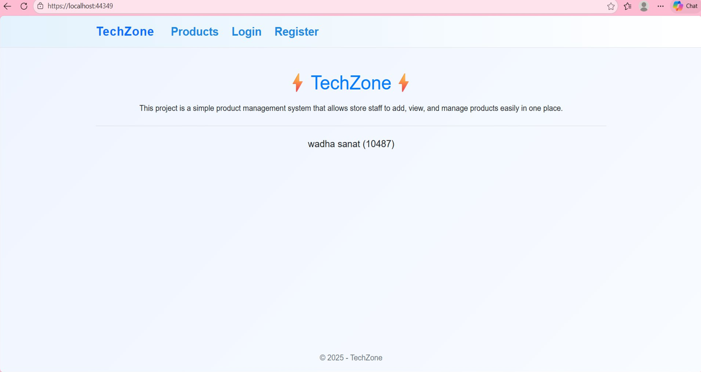
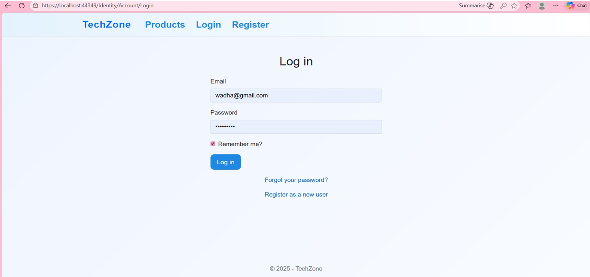
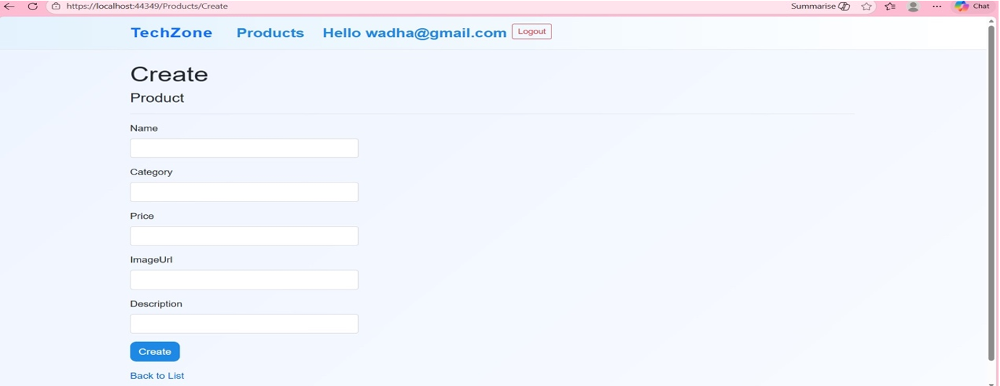
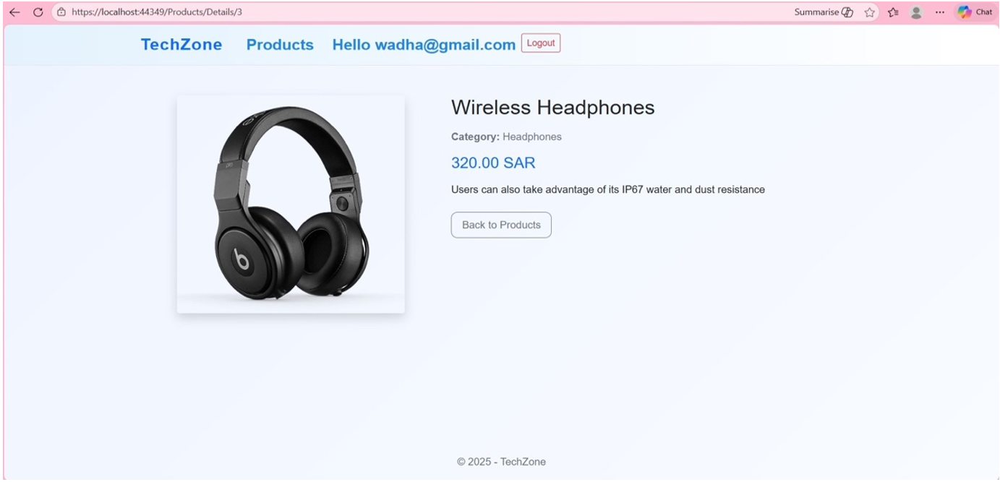
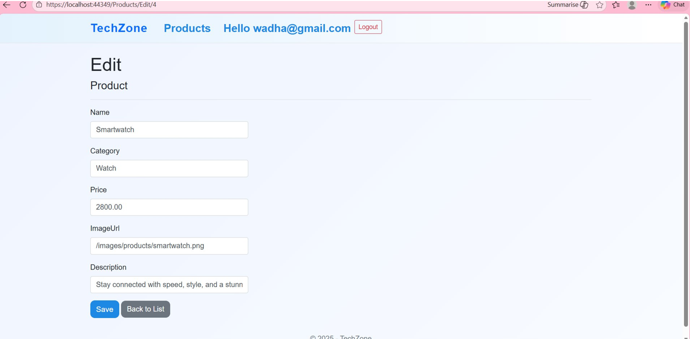
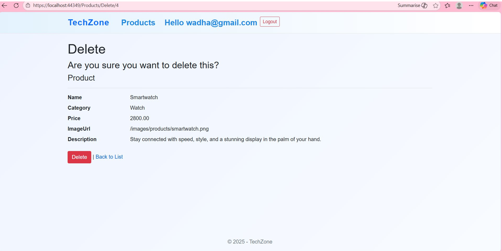

# Tech-zone
How to Run the Project:
Download or clone the repository.
Open the (TechZone. sin file in Visual Studio.
Create the database using the provided
SQL script.
Update the connection string in appsettings. json to match your local SQL Server instance.
Build and run the project.
## Project Screenshots

| Home Page | Log in Page | Register Page | Products |
| :---: | :---: | :---: | :---: |
|  |  |  |  |

| Create | Details | Edit | Delete |
| :---: | :---: | :---: | :---: |
|  |  |  |  |
